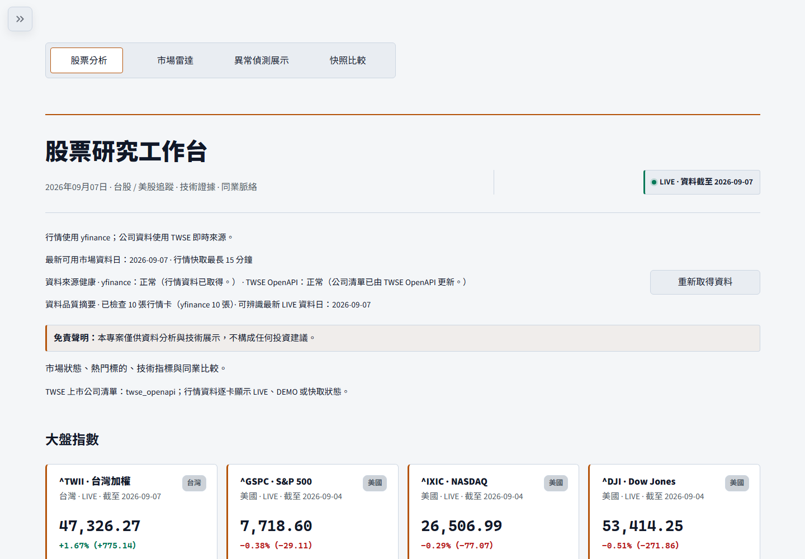
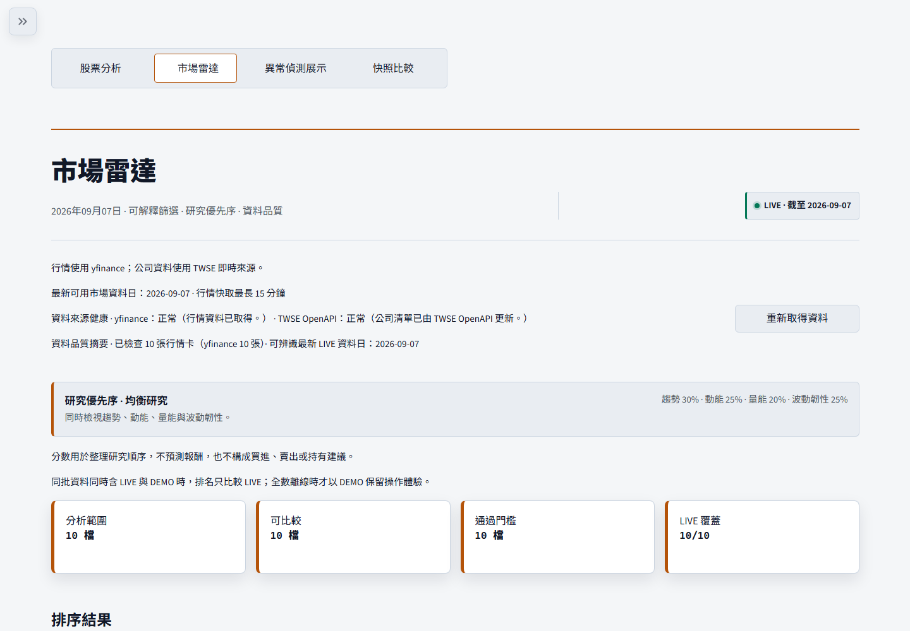
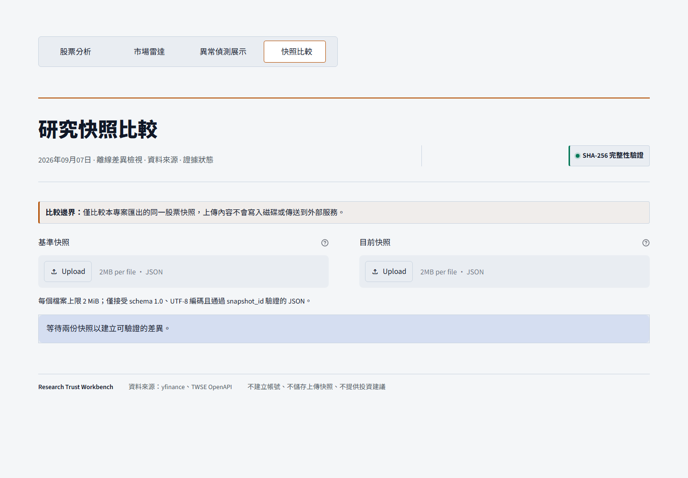

# Research Trust Workbench

面向台股與美股的可解釋研究工作台。它把行情來源、資料品質、技術證據、同業脈絡與可驗證研究快照放進同一個工作流；它不是股價預測器、交易訊號產生器或投資建議服務。

## 介面預覽

## 核心能力

- 台股／美股代號正規化、OHLCV、均線、RSI、成交量與波動率。
- 研究就緒度與 Evidence Coherence，將資料來源、更新時效與樣本深度直接呈現。
- 可解釋市場雷達：產業篩選、透明研究配置、最低證據門檻與穩定排序。
- 異常偵測展示：Z-score、Isolation Forest、價格波動與 pseudo-label 評估。
- Research Snapshot JSON、可列印 HTML 與快照比較；包含 snapshot_id、來源狀態、方法 fingerprint 與 SHA-256。
- 外部 API 失敗時顯示 DEMO／cache／offline 狀態，不把示範資料偽裝成即時行情。
- 研究備忘錄只存在目前 Streamlit session，不建立帳號或伺服器端個人資料庫。

## 資料與架構

~~~text
yfinance / TWSE OpenAPI / sample fallback
                ↓
來源狀態、代號正規化與資料品質檢查
        ├─ 股票研究摘要與技術證據
        ├─ 市場雷達與候選排序
        └─ 異常偵測 pipeline
                ↓
Streamlit pages → Research Snapshot → Snapshot Comparison
~~~

主要模組：app.py 負責 UI 與路由；src/market_api.py 處理 provider、timeout 與 fallback；src/research_brief.py、research_readiness.py、research_coherence.py 負責可測試的研究邏輯；src/market_screener.py 負責市場雷達；src/research_snapshot.py 與 snapshot_compare.py 負責可驗證快照。

## Quick start

需求：Python 3.10+。Windows 快速啟動：

~~~powershell
git clone https://github.com/Lily09-project/market-anomaly-dashboard.git
cd market-anomaly-dashboard
.\run_project.bat
~~~

只執行完整驗收：

~~~powershell
.\run_project.bat --validate
~~~

手動啟動：

~~~powershell
.\.venv\Scripts\python.exe -m pip install -r requirements.txt
.\.venv\Scripts\python.exe run_all.py --mode sample
.\.venv\Scripts\python.exe -m streamlit run app.py --server.port 8765
~~~

完整 browser UI QA：

~~~powershell
.\.venv\Scripts\python.exe -m playwright install chromium
.\.venv\Scripts\python.exe quality\run_acceptance.py release
~~~

## 研究工作流與資料來源與降級

- LIVE 表示由 provider 取得資料，仍需檢查最新交易日與完整度。
- DEMO 是可重現示範資料，不可視為真實價格或報酬。
- 研究就緒度與市場雷達是資料條件及描述性證據，不是股票評分或買賣訊號。
- 本專案不提供買賣建議。
- 異常偵測使用 pseudo-label；正式研究仍需人工標註與外部驗證。
- 上游 API、交易休市、代號不存在與資料延遲都可能造成缺資料。

研究流程與頁面細節見 [docs/research-workflow.md](docs/research-workflow.md) 及 [docs/user-guide.md](docs/user-guide.md)。Research Snapshot 可離線驗證；Snapshot Comparison 只比較已上傳且通過完整性檢查的快照。

## 品質與安全

release profile 會執行 sample pipeline、smoke test、pytest、compile、pip check、public release guard、Bandit、依賴稽核、Docker 設定檢查與 desktop／mobile browser UI QA。測試定義見 [quality/test-manifest.json](quality/test-manifest.json)，安全政策見 [SECURITY.md](SECURITY.md)，部署說明見 [docs/deployment.md](docs/deployment.md)。

公開 repository 不包含 API 金鑰、.env、Streamlit secrets、使用者研究資料、cache 或本機產物。部署時請把 secrets 設在平台設定中。
