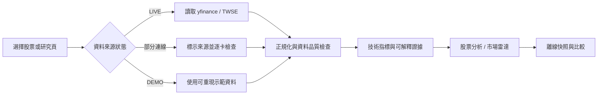
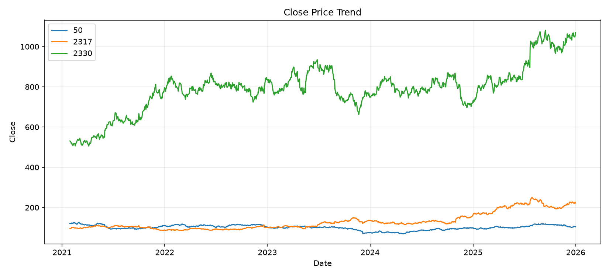
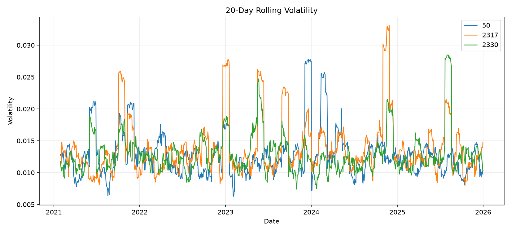
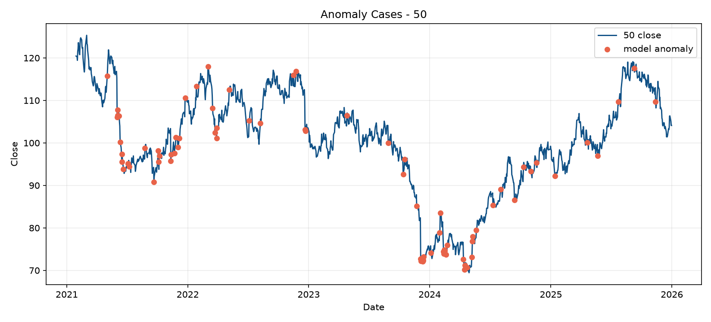

# Research Trust Workbench

繁體中文名稱：**股票研究可信度工作台**

[](https://github.com/Lily09-project/market-anomaly-dashboard/actions/workflows/security.yml)

一個面向台股與美股的可解釋股票研究儀表板。它把行情資料、技術證據、資料來源狀態、同業脈絡與可驗證的研究快照放在同一個工作流中，讓使用者在解讀圖表之前，先知道資料是否可用、證據來自哪裡，以及目前結論有哪些限制。

本專案不是股價預測器，也不是交易訊號產生器。它刻意不提供買賣建議、目標價或報酬保證，而是展示一個可實際使用、可測試、可維護的金融資料產品應如何處理資料品質、外部 API 失敗、可解釋分析與安全公開。

## 三分鐘快速體驗

如果只想快速確認目前版本是否能啟動，請使用 Windows 啟動器：

~~~powershell
git clone https://github.com/Lily09-project/market-anomaly-dashboard.git
cd market-anomaly-dashboard
.\run_project.bat
~~~

啟動器會依序檢查專案路徑、建立或確認 .venv、安裝 requirements-dev.txt、執行 sample pipeline、smoke test 與 pytest，最後啟動固定網址 http://localhost:8765。這個流程刻意把資料產物生成與測試放在啟動前，讓展示畫面不會建立在未驗證的本機殘留檔案上。

## 專案定位與可解釋研究工作台

許多金融儀表板可以畫出價格和指標，但研究流程通常還缺少幾個重要問題：

- 目前資料是即時行情、快取資料，還是示範資料？
- 最新可用交易日是哪一天？資料是否有缺欄位或觀測不足？
- 技術判讀由哪些可追溯指標組成，而不是由一個無法解釋的分數決定？
- 個股相對同業或候選標的處在什麼位置？
- 研究結果能否離線保存、驗證並在稍後比較？

Research Trust Workbench 將這些問題設計成產品的一部分：資料狀態與限制會直接顯示在頁面上，分析邏輯與 UI 分離，外部服務失效時不會把示範資料偽裝成真實行情，匯出的研究快照也保留來源與完整性資訊。

## 核心功能

### 股票分析

股票分析是主要使用流程，支援熱門股票、自訂代號與台股／美股混合研究。

- 大盤指數與熱門股總覽，股票代號與公司名稱會同時顯示。
- 支援台股代號自動轉換，例如 `2330` 轉為 `2330.TW`。
- 個股 K 線、移動平均線、成交量、RSI(14) 與近期變化。
- 股票基本資料：市值、成交量、20 日均量、52 週高低點等可用欄位。
- 四個可解釋證據面向：趨勢、動能、量能與風險／波動。
- 研究就緒度（Research Readiness）：以資料來源（30 分）、更新時效（25 分）、OHLCV 覆蓋（25 分）與樣本深度（20 分）揭露目前分析條件。
- 證據一致性（Evidence Coherence）：辨識趨勢、動能、量能與風險是否同向、分歧或資料不完整，不把四項證據壓成買賣分數。
- 品質硬性上限：DEMO／非 yfinance 來源、超過 14 天的舊資料、低於 80% 覆蓋率或不足 20 筆觀測，都會限制最高分並列出下一步修正。

研究就緒度不是股票評分，也不代表投資價值。它回答的是「這份資料是否足以進入技術研究」，並將來源降級、資料過期與樣本不足轉成可驗證的產品狀態，避免畫面正常就被誤認為資料可信。
- 近期價格、RSI、MA20 距離與 20 日波動率變化。
- 產業同類比較，資料不足時直接顯示無法比較，不補造排名。
- 匯出離線 Research Snapshot JSON 與可列印 HTML。

### 可解釋市場雷達

市場雷達是獨立的研究排序頁，不與異常偵測混在同一個畫面。它從熱門代表清單建立候選池，協助使用者整理研究優先順序；它不是全市場掃描器，也不是投資建議引擎。

- 產業篩選：台股上市、ETF、美股及其他可用類別。
- 四種透明研究配置：均衡研究、趨勢優先、動能量價、波動控制。
- 最低證據分數與候選池規模控制。
- 每個候選標的同時顯示代號、公司名稱、產業、資料來源與資料日期。
- 排名卡呈現總分與四項分數，完整表格提供 RSI、量比、20 日波動率等細節。
- 若同一批資料同時包含 LIVE 與 DEMO，只比較 LIVE 標的；全數離線時才以 DEMO 保留操作體驗。
- 產業、研究配置、最低分數與候選池規模會同步到 URL，可重新整理或分享研究條件。

市場雷達使用至少 60 個有效交易日計算長期均線與風險證據。資料不足、必要欄位缺失或指標非有限值的標的不會被包裝成假精準分數。

### 異常偵測展示

異常偵測保留為獨立頁面，服務的是資料工程與模型流程展示，而不是個股研究的核心判讀。

- 市場價格趨勢與 20 日波動率。
- Z-score 基準與 Isolation Forest 異常偵測結果。
- 異常日期清單與模型結果展示。
- 匯率趨勢與 USD/TWD 示範資料。
- `pseudo-label` 評估流程，並清楚標示評估結果不代表投資績效。

### Research Snapshot 與快照比較

個股頁可以將目前畫面中的研究脈絡匯出成離線（offline）快照。快照包含：

- `snapshot_id` 與資料日期。
- 資料來源、來源狀態與資料品質警示。
- 技術證據、近期變化與同業脈絡。
- 快照也保存證據一致性摘要，讓下載後的研究紀錄與頁面判讀保持一致。
- 正規化 OHLCV 輸入的 SHA-256 fingerprint。

快照比較頁可以比較同一股票的兩份 schema `1.0` JSON：

- 驗證 JSON 結構、必要欄位與檔案大小限制。
- 重新計算並驗證 `snapshot_id` 與歷史資料 fingerprint。
- 拒絕被竄改、跨股票、格式錯誤或不支援版本的快照。
- 依穩定證據 ID 比較內容，而不是依清單位置比對。
- 上傳資料只在記憶體中處理，不寫入伺服器，也不傳送到外部服務。

## 研究工作流與使用流程



每個主要頁面都保留正常、載入、空資料、來源失敗與資料不足狀態。外部資料無法取得時，介面仍可操作，但會明確顯示 `DEMO` 或 `離線`，不會把 fallback 標成 `LIVE`。

## 資料來源與降級策略

| 資料 | 來源 | 用途 | 失敗時的行為 |
| --- | --- | --- | --- |
| 台股與美股歷史行情 | [yfinance](https://github.com/ranaroussi/yfinance) | OHLCV、K 線、均線、RSI、成交量 | 使用明確標示為 `DEMO` 的本機 sample data |
| 台股公司清單與分類 | [TWSE OpenAPI](https://openapi.twse.com.tw/) | 公司名稱、代號、產業與公司脈絡 | 使用可用快取或內建清單，並揭露來源狀態 |
| TWSE 公司治理／ESG 法律資料 | TWSE OpenAPI `t187ap46_L_20` | 個股脈絡與展示資料 | 缺資料時保留可用個股分析，不偽造欄位 |
| 異常偵測市場資料 | 本機 pipeline | 特徵工程、模型訓練與評估 | `sample` 模式產生可重現資料 |
| 匯率資料 | 設定檔中的 API 或本機 sample | USD/TWD 趨勢展示 | 未設定 API 時使用 sample fallback |

畫面中的資料狀態有以下語意：

| 顯示狀態 | 意義 |
| --- | --- |
| `LIVE` | 行情由 yfinance 取得，仍需檢查資料截至日期 |
| `部分連線` | 同一批資料混有真實與示範行情，需逐卡查看來源 |
| `DEMO` | 示範資料，價格與漲跌不可視為真實市場行情 |
| `離線` | 目前沒有可用行情資料，應重新連線或稍後再試 |

行情快取最長 15 分鐘。交易休市、供應商限制、網路中斷或代號不存在，都可能讓最新資料日早於今天。股票研究摘要至少需要 20 筆有效收盤資料；市場雷達則要求至少 60 個有效交易日。

## 技術分析方法

本專案使用透明的描述性技術證據，不使用黑箱模型產生股票建議。

| 面向 | 主要證據 | 解讀方式 |
| --- | --- | --- |
| 趨勢 | Close、MA5、MA20、MA60 | 描述價格與均線結構的相對位置 |
| 動能 | RSI(14) | 描述近期漲跌動能，不轉換成買賣指令 |
| 量能 | 最新成交量與 20 日均量 | 判斷價格變化是否伴隨市場參與 |
| 風險 | 20 日報酬波動率 | 描述近期波動，不等同於低風險保證 |

市場雷達將四項因子轉為 35、70、100 等離散證據分數，再依公開配置加權。配置只改變研究排序，不改寫底層資料與因子計算。相同分數時以股票代號穩定排序，確保結果可重現。

## 系統架構

```text
External providers
  ├─ yfinance: historical market data
  └─ TWSE OpenAPI: company metadata and public context
              │
              v
src/market_api.py
  ├─ provider requests and timeout handling
  ├─ symbol normalization
  ├─ source-aware fallback
  └─ technical indicators
              │
              ├───────────────┐
              v               v
src/research_brief.py   src/market_screener.py
  │                     │
  ├─ evidence            ├─ radar factors
  ├─ changes             ├─ scoring profiles
  └─ peer context        └─ deterministic ranking
              │               │
              └───────┬───────┘
                      v
                 app.py
          Streamlit pages and themes
                      │
              ┌───────┴────────┐
              v                v
      Research Snapshot   Snapshot Comparison

Anomaly workflow is independently executed by run_all.py:
fetch -> preprocess -> features -> Isolation Forest -> evaluation -> charts
```

### 模組責任

- `app.py`：Streamlit 入口、路由、頁面組裝、主題與全域 UI 樣式。
- `src/market_api.py`：yfinance／TWSE 存取、代號轉換、timeout、fallback、快取支援與技術指標。
- `src/research_brief.py`：股票研究摘要的純函式邏輯，不依賴 Streamlit 或網路。
- `src/research_readiness.py`：以可測試規則建立研究就緒度、品質上限與修正建議。
- `src/research_coherence.py`：以固定證據狀態辨識同向、分歧、風險偏多與資料不完整。
- `src/market_screener.py`：市場雷達的資料門檻、因子評分、研究配置與穩定排序。
- `src/market_radar_page.py`：市場雷達控制項、候選池、表格與個股導覽。
- `src/research_snapshot.py`：快照 schema、canonical content、fingerprint 與匯出資料。
- `src/snapshot_compare.py`：快照驗證、內容比對、來源變化與比較結果。
- `src/fetch_market_data.py`、`src/fetch_fx_data.py`：pipeline 外部資料抓取與欄位正規化。
- `src/preprocess.py`、`src/features.py`：異常偵測資料清理與特徵工程。
- `src/train_anomaly_model.py`、`src/evaluate.py`：模型訓練、pseudo-label 評估與圖表產生。
- `run_all.py`：可重現的 sample／API pipeline 入口。
- `tests/`：資料處理、模型、快照、UI contract、Streamlit runtime、fallback 與安全測試。

## 頁面路由與可分享 URL

| 頁面 | URL 範例 | 用途 |
| --- | --- | --- |
| 股票分析 | `/?page=stocks&symbol=2330.TW` | 個股研究與技術證據 |
| 市場雷達 | `/?page=radar&industry=ETF&profile=defensive&min_score=65&pool_size=6` | 候選池排序與研究優先序 |
| 異常偵測展示 | `/?page=anomalies` | 資料工程與模型流程展示 |
| 快照比較 | `/?page=compare` | 離線驗證兩份研究快照 |

URL 只保存頁面與研究篩選條件，不保存帳號、投資組合或伺服器端使用者資料。

## 安裝與本機啟動

### 環境需求

- Python 3.12；專案主要依賴已在 CI 與本機驗證。
- Windows 可使用 `run_project.bat` 一鍵建立或檢查 `.venv`。
- Docker 可直接建置不依賴本機 Python 環境的 production image。

### 手動安裝

```powershell
cd "C:\path\to\market-anomaly-dashboard"
py -3.12 -m venv .venv
.venv\Scripts\python.exe -m pip install --upgrade pip
.venv\Scripts\python.exe -m pip install -r requirements-dev.txt
```

### Windows 一鍵啟動

```powershell
.\run_project.bat
```

啟動器會：

1. 切換到 BAT 所在的專案目錄。
2. 印出實際專案路徑，避免從錯誤資料夾啟動。
3. 建立或檢查 `.venv`，並安裝依賴。
4. 執行 sample pipeline、smoke test 與 pytest。
5. 使用固定 port `8765` 啟動 Streamlit。

成功啟動後開啟：<http://localhost:8765>

若 `8765` 已被使用，啟動器會停止並顯示目前 process ID，不會默默改用其他 port 造成連線混淆。

### 手動執行

```powershell
.venv\Scripts\python.exe run_all.py --mode sample
.venv\Scripts\python.exe src\smoke_test.py
.venv\Scripts\python.exe -m streamlit run app.py --server.port 8765
```

`sample` 模式適合離線展示與測試。`api` 模式會依 `config.yaml` 中的 `market_url` 與 `fx_url` 讀取外部資料；若 URL 未設定或請求失敗，pipeline 會清楚提示並使用 sample fallback。

## Docker 部署

Production image 使用 Python 3.12 slim、非 root 使用者 `appuser`、固定 port `8765`、health check 與關閉 Streamlit telemetry。

```powershell
docker build -t research-trust-workbench .
docker run --rm -p 8765:8765 research-trust-workbench
```

健康檢查：

```powershell
curl http://127.0.0.1:8765/_stcore/health
```

預期回應為 `ok`。部署到公開環境時，請由平台終止 TLS、只允許必要的 outbound HTTPS、設定 request limits，並避免掛載使用者快照或其他個人資料儲存空間。詳細部署規範見 [`docs/deployment.md`](docs/deployment.md)。

## 測試與品質保證

本專案把資料品質與失敗狀態視為產品功能，而不是只測試 happy path。

```powershell
# 完整測試
.venv\Scripts\python.exe -m pytest -q

# 編譯檢查
.venv\Scripts\python.exe -m compileall -q app.py src tests

# Python 靜態安全掃描
.venv\Scripts\python.exe -m bandit -q -r app.py src

# 已安裝套件的依賴一致性
.venv\Scripts\python.exe -m pip check

# 已知漏洞掃描
.venv\Scripts\python.exe -m pip_audit --strict

# 啟動與資料產物煙霧測試
.venv\Scripts\python.exe src\smoke_test.py
```

測試範圍包括：

- 資料欄位正規化、數值清理、日期解析與缺欄位處理。
- RSI 單邊上漲、單邊下跌與盤整等邊界情境。
- yfinance／TWSE 失敗時的 fallback 與來源狀態。
- 市場雷達因子分數、最低資料門檻、LIVE／DEMO 排名策略與 URL 篩選還原。
- Streamlit 頁面路由、主要互動、主題 contract 與 runtime 行為。
- Research Snapshot schema、SHA-256 完整性、跨股票／竄改／超大檔案拒絕。
- anomaly pipeline 的 preprocessing、features、model、evaluation 與 smoke test。
- BAT 啟動器的 Python 搜尋、固定 port、專案路徑輸出與錯誤處理。

目前本機完整驗證結果：`77 passed`，另通過 compile、Bandit、pip check、pip-audit 與 smoke test。

GitHub Actions 位於 [`.github/workflows/security.yml`](.github/workflows/security.yml)，在 push、pull request 與每週排程執行依賴稽核、Bandit、pytest、Docker build 與 container health check；Dependabot 設定位於 [`.github/dependabot.yml`](.github/dependabot.yml)。

## 安全與隱私

- 不在前端或 repository 中放置 API key、token、password 或 private key。
- API timeout、HTTP error 與解析錯誤會進入明確的降級流程。
- 上傳的 Research Snapshot 只在記憶體中處理，不寫入磁碟或傳到第三方服務。
- 不需要帳號，不收集姓名、Email 或投資組合資料。
- `.gitignore` 排除 `.env`、快取、原始資料、處理後資料、模型、報表與本機產物。
- Docker 以非 root 使用者執行。
- 公開部署應由平台處理 TLS、request limits、監控與日誌政策，不應記錄上傳快照內容。

漏洞回報方式見 [`SECURITY.md`](SECURITY.md)。

## 限制與明確不做的事

本專案不：

- 預測股價方向或未來報酬。
- 產生目標價、買進、賣出或持有建議。
- 將異常事件解釋為交易訊號。
- 將 pseudo-label 評估當成真實市場標籤或投資績效。
- 把 DEMO 或 fallback 行情偽裝成 LIVE。
- 提供完整全市場掃描、帳號、投資組合同步、資料庫或雲端使用者紀錄。

yfinance 與 TWSE OpenAPI 的可用性、資料延遲、交易時段、供應商限制與股票代號有效性都會影響結果。任何研究結論都應先確認資料來源、資料截止日與頁面上的限制警示。

## 面試與工程重點

這個專案的價值不在於把圖表堆到畫面上，而在於把金融資料產品最容易被忽略的工程問題做成可驗證的設計：

1. **Provenance-first**：每張行情卡與研究結果都保留來源、資料日與降級狀態。
2. **Explainability over false precision**：用四個可追溯的證據面向呈現原因，不用單一黑箱分數代替判斷。
3. **Safe degradation**：外部 API 失敗時保留可操作的 DEMO flow，但明確標示非真實行情。
4. **Deterministic research contract**：快照以 canonical content 與 SHA-256 fingerprint 保留可驗證的研究脈絡。
5. **Separated product concerns**：股票分析、市場雷達、異常偵測與快照比較分頁處理不同任務，避免將異常模型誤當成個股建議。
6. **Testable architecture**：資料來源、純函式分析邏輯、UI 組裝與 pipeline 分離，讓大部分核心行為可以離線測試。
7. **Public-release discipline**：只公開可重現的程式、測試、sample data 與文件，不公開 credentials、cache、模型產物或本機報表。

## 專案狀態

這是一個可執行的 side project 與面試作品基礎，已具備本機開發、Docker 建置、CI 安全檢查、資料來源降級、響應式 UI 與離線研究快照流程。後續若要擴展成正式服務，建議優先補上資料供應商的 production SLA、伺服器端快取策略、觀測性、使用者權限與正式市場資料授權，而不是直接把目前的 DEMO fallback 當作即時交易系統。

## 相關文件

- [`docs/user-guide.md`](docs/user-guide.md)：頁面操作、資料狀態與使用限制。
- [`docs/research-workflow.md`](docs/research-workflow.md)：研究工作流、證據定義與快照驗證原則。
- [`docs/deployment.md`](docs/deployment.md)：Docker、公開部署與健康檢查要求。
- [`SECURITY.md`](SECURITY.md)：漏洞回報與敏感資料政策。
## 快速導覽與實際產出預覽

這個 repository 的公開入口分成四個使用情境：

1. 股票分析：以股票代號與公司名稱為主鍵，查看 K 線、均線、RSI、成交量、基本資料與產業比較。
2. 市場雷達：以透明的研究配置整理候選標的，提供產業篩選、最低證據分數與可追溯排名。
3. 異常偵測展示：獨立展示資料清理、特徵工程、Isolation Forest 與異常日期，不混入個股研究頁。
4. 快照比較：把研究結果保存成可驗證 JSON，再比較兩個時間點的證據、來源與完整性。

### Sample pipeline 的實際圖表

下列圖片由目前專案執行 run_all.py --mode sample 產生，與測試使用同一套資料流程。圖片是可重現的 pipeline 輸出，不是即時行情，也不是手工製作的產品 mockup。



價格趨勢與異常事件：驗證清理後的價格資料、日期排序與異常標記是否能正確產生。



波動率趨勢：呈現近期風險行為，不能直接解讀為投資建議或低風險保證。



異常案例摘要：驗證模型輸出能轉成可閱讀的報告產物。

目前開發環境沒有瀏覽器截圖驅動，因此 repository 不放未經目前 commit 驗證的舊 UI 截圖。要更新 UI 截圖時，請先啟動固定網址 http://localhost:8765，再以同一版本重新截圖並更新圖片說明。

## 面試展示建議

建議用以下順序展示，能在短時間內說清楚產品價值與工程取捨：

1. 先從股票分析頁輸入 2330，說明台股代號會轉換成 2330.TW，並且畫面同時保留股票代號、公司名稱、產業與資料來源。
2. 切換產業篩選與同業比較，說明這不是單一指標下結論，而是把趨勢、動能、量能與波動拆成可讀證據。
3. 關閉網路或使用 sample 模式，展示 LIVE、DEMO、快取與離線狀態如何被明確區分。
4. 進入市場雷達，調整研究配置與最低分數，展示 deterministic ranking 與 URL 可分享研究條件。
5. 最後進入異常偵測展示，說明這一頁是資料工程與模型流程展示，刻意與股票分析分頁隔離，避免把異常標記包裝成交易訊號。
6. 匯出 Research Snapshot，展示 schema 驗證、SHA-256 fingerprint 與跨版本比較。

## 公開 Release Checklist

發布或面試展示前，建議確認：

- [ ] git status 沒有未提交的意外檔案。
- [ ] .env、API key、token、private key 沒有進入 Git history。
- [ ] models、reports、data/raw、data/processed 與 cache 沒有被 Git 追蹤。
- [ ] README 的啟動命令與實際固定 port 8765 一致。
- [ ] sample pipeline 可以在沒有外網時完成。
- [ ] LIVE、DEMO、離線與資料日期在畫面上有明確區分。
- [ ] 股票分析與異常偵測仍是不同頁面。
- [ ] 快照上傳只在記憶體處理，沒有寫入使用者檔案。
- [ ] pytest、compileall、Bandit、pip check 與 pip-audit 都重新驗證。
- [ ] Docker health check 與 GitHub Actions 都成功。

## 文件與程式碼導覽

| 路徑 | 職責 |
| --- | --- |
| app.py | Streamlit 入口、頁面路由、全域 UI 與主題 |
| src/market_api.py | yfinance、TWSE OpenAPI、代號正規化與 fallback |
| src/research_brief.py | 個股研究摘要與技術證據 |
| src/market_screener.py | 市場雷達門檻、因子與穩定排序 |
| src/market_radar_page.py | 雷達頁面控制項、表格與導覽 |
| src/research_snapshot.py | 快照 schema、canonical content 與 fingerprint |
| src/snapshot_compare.py | 快照安全驗證與比較 |
| run_all.py | sample/API pipeline 入口 |
| run_project.bat | Windows 固定 port 啟動器 |
| tests/ | 單元、整合、Streamlit runtime 與公開 release 測試 |

## 常見問題補充

### 啟動時為什麼會先跑測試？

run_project.bat 把 sample pipeline、smoke test 與 pytest 放在啟動流程中，是為了避免使用者在測試未通過時看到不可信的頁面狀態。若只需要快速啟動已驗證環境，也可以直接使用：

~~~powershell
.venv\Scripts\python.exe -m streamlit run app.py --server.port 8765
~~~

### 為什麼畫面可能沒有今天的資料？

行情服務會受到交易時間、休市、供應商延遲、代號有效性與網路連線影響。請以頁面顯示的資料截至日期與來源狀態為準，不要只用電腦當前日期判斷資料是否錯誤。

### 這個專案最適合展示什麼能力？

它適合展示金融資料產品中的資料 provenance、來源降級、可解釋技術證據、deterministic ranking、快照完整性驗證、Streamlit runtime testing、CI 安全檢查與 Docker health check。這些設計比單純堆疊圖表更能反映可維護產品的工程品質。