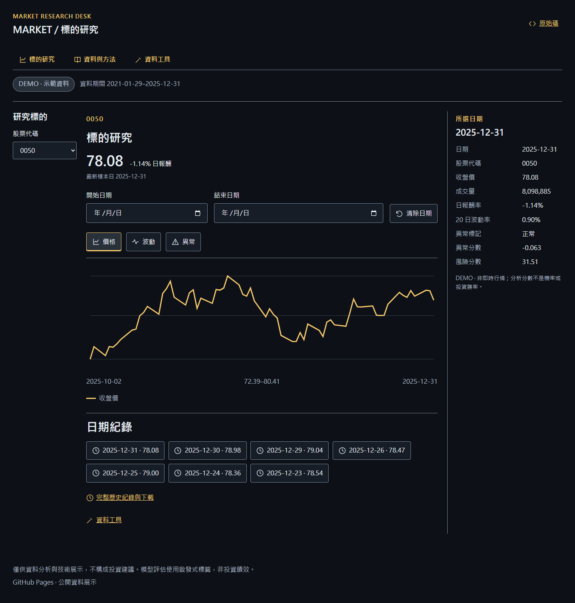
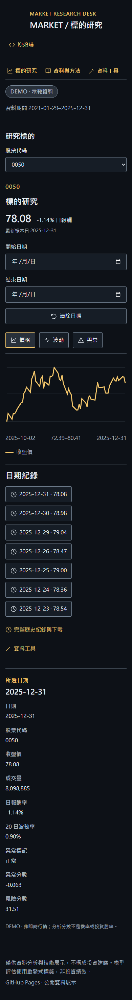

# Market Research — 標的研究工作台

[](https://github.com/Lily09-project/market-anomaly-dashboard/actions/workflows/security.yml)

以 Python 建立市場資料與可解釋異常分析；公開展示版以單一股票代碼的歷史研究為核心。

[開啟互動展示網站](https://lily09-project.github.io/market-anomaly-dashboard/) · 不需登入，也不需作者的裝置開機。

## 展示版重點

- 選擇標的與期間，查看收盤價、原始 20 日波動率及模型標記日期。
- 日期紀錄與明細連動，保留成交量、日報酬及原始模型分數。
- 完整紀錄可篩選、排序、比較和下載；兩份 JSON 快照在瀏覽器本地驗證與比較。

GitHub Pages 使用可重現的合成行情，不是即時行情、交易訊號或投資建議。模型分數不是機率或投資勝率。Python／Streamlit 另提供完整研究流程。

## 介面




## 本機啟動

需求：Python 3.12；Windows 可使用專案啟動器。

```powershell
git clone https://github.com/Lily09-project/market-anomaly-dashboard.git
cd market-anomaly-dashboard
.\run_project.bat
```

## 測試與安全

```powershell
python -m pytest -q
```

CI 執行品質、安全與 Pages 瀏覽器驗收。公開展示只發布經允許的靜態檔案與欄位；金鑰、個人資料和本機暫存不應提交。SHA-256 用於內容完整性核對，不代表來源身分認證。

部署與功能邊界見 [GitHub Pages 指南](docs/GITHUB_PAGES.md)，安全通報見 [SECURITY.md](SECURITY.md)。

## 研究工作流與資料來源與降級

Python／Streamlit 是可解釋研究工作台，包含可解釋市場雷達（`src/market_screener.py`）、Research Snapshot（`snapshot_id` 與 SHA-256）及 Snapshot Comparison。不提供買賣建議；LIVE 需檢查交易日與完整度，DEMO／cache／offline 均明確標示。

深入操作見 [研究工作流](docs/research-workflow.md)、[使用指南](docs/user-guide.md) 與 [部署指南](docs/deployment.md)。
